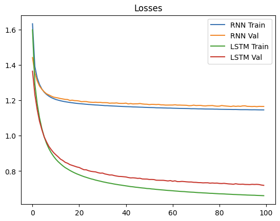

### Loss Graph

1. Handling Long-Term Dependencies
LSTM: LSTMs are designed to capture long-term dependencies in sequences. They use a gating mechanism (input gate, forget gate, and output gate) to control the flow of information and maintain long-term memory. This allows LSTMs to remember important information over long periods and forget irrelevant information, leading to more effective learning, especially for sequences with long-term dependencies.

RNN: Vanilla RNNs struggle with long-term dependencies due to the vanishing gradient problem. When training with backpropagation through time (BPTT), gradients can diminish exponentially, making it difficult for RNNs to learn dependencies that span many time steps.

2. Gradient Flow
LSTM: The architecture of LSTMs includes mechanisms to preserve gradients over long sequences. The cell state and gated architecture help in maintaining a more stable gradient flow during training, which mitigates the vanishing gradient problem.

RNN: In contrast, RNNs without any gating mechanisms are more prone to the vanishing gradient problem, leading to ineffective learning over long sequences. This results in higher training and validation losses as the model fails to learn long-term dependencies effectively.

3. Flexibility and Complexity
LSTM: LSTMs have more parameters and a more complex architecture compared to vanilla RNNs. This complexity allows LSTMs to model more nuanced relationships in the data. The added flexibility comes from the additional gates and cell state, which enhance the model's capacity to learn from complex sequential data.

RNN: Vanilla RNNs have a simpler architecture with fewer parameters. While this simplicity can be advantageous in terms of computational efficiency, it limits the model's ability to capture complex patterns in the data, especially when dealing with long sequences.

### different samples generated from different seed characters with different T
Vanilla RNN Generated Samples:
------------------------------
Seed: I

Generated:
 I see her beauty in the supple the corn of my son, my lord, like and so do I mean to see him soul, t
------------------------------
Seed: love

Generated:
 love to Rome, and the common men the senate, who three, the senate, what I will not stay have see hi
------------------------------
Seed: should

Generated:
 should be so die the consul, and the common for me to my lord, your country's prove a proud as the s
------------------------------
Seed: the

Generated:
 the common for than the senate, which the senate, what I will not sleeping, and the common men the s
------------------------------
Seed: happy

Generated:
 happy in the suppliant me to the people,
Because the consul, when he shall be so much many my son, m
LSTM Generated Samples:
------------------------------
Seed: I

Generated:
 I have done't?

CORIOLANUS:
What must I say?
'I Pray, sir'--Plague upon't! I cannot bring
My tongue 
------------------------------
Seed: love

Generated:
 love him: lend you you say, my lord, your son, the melancholy face to stake on you this?

VOLUMNIA:

------------------------------
Seed: should

Generated:
 should be my name is Marcius.

MENENIUS:
What is become of Marcius 'O if he
Had borne the bastards d
------------------------------
Seed: the

Generated:
 the city and
Be every man himself?

SICINIUS:
Peace!

MENENIUS:
What is about to be? I am out of bre
------------------------------
Seed: happy

Generated:
 happy day set to stay him, overboard,
Into the gods!

CORIOLANUS:
Ay, but not mine own desire.

Thir

T = 0.5\
\
Vanilla RNN Generated Samples:\
------------------------------\
Seed: I\
\
Generated:\
 I shall falling our tribes the modns to me for your grace.\
\
GLOUCESTER:\
What, shall the people.\
\
All\
------------------------------\
Seed: love\
\
Generated:\
 love that have with us.\
\
LARTIUS:\
On the news of this a happy on your brain;\
And I will not yours.\
\
\
------------------------------\
Seed: should\
\
Generated:\
 should the violent to kill me to me, sir, sir.\
\
LARTIUS:\
A goodly still that with all the people cut\
------------------------------\
Seed: the\
\
Generated:\
 the city is this dead: stand up this soul the senate, I curses down the gods for the coronation.\
I h\
------------------------------\
Seed: happy\
\
Generated:\
 happy vice than the house, let us go.\
\
VOLUMNIA:\
I do not so remain of the devil.\
But custom of more\
LSTM Generated Samples:\
------------------------------\
Seed: I\
\
Generated:\
 I had rather had a taste of straition the least cass,\
If heaven will take the numb cold number,\
Who \
------------------------------\
Seed: love\
\
Generated:\
 love of the king.\
\
GLOUCESTER:\
A blessed labour, my most sovereign liege:\
Amen willing flies strong\
\
------------------------------\
Seed: should\
\
Generated:\
 should be my Marcius is content:\
The action. let's reap is such a name it.\
\
LADY ANNE:\
I will go wro\
------------------------------\
Seed: the\
\
Generated:\
 their very heart with sorrow in the city might show'd us both.\
\
Both:\
Well, well, no more.\
\
First Se\
------------------------------\
Seed: happy\
\
Generated:\
 happy day set to gibe.\
\
LARTIUS:\
I'll not be the ears the tumbling begins with him? You are they\
Tha\
\
T = 0.9\
\
Vanilla RNN Generated Samples:\
------------------------------\
Seed: I\
\
Generated:\
 I see my success! Romars,\
Pray you, gentle.\
\
BRUTUS:\
So not stay\
I let his virtue.\
\
Third Servingman\
------------------------------\
Seed: love\
\
Generated:\
 love to be other in your knowledged in noble.\
\
SICINIUS:\
All, as which first cush: I loved the voice\
------------------------------\
Seed: should\
\
Generated:\
 should stand upon his great assured,\
And cry they were in ears our censures, divines, the deed\
Our s\
------------------------------\
Seed: the\
\
Generated:\
 the people,\
Hold myself a boar croports,\
My death.\
\
LARTIUS:\
No, sir, so bad so down grow\
The change\
------------------------------\
Seed: happy\
\
Generated:\
 happy days, and not live, I'll leave our way doub it, this all the man and\
thing to a shame slaves,\
\
LSTM Generated Samples:\
------------------------------\
Seed: I\
\
Generated:\
 I cannot our seats and hapferent before a wanton an ally accipeas\
Oring battles tear,\
Self-loving, I\
------------------------------\
Seed: love\
\
Generated:\
 love the hearts of Rome tomorrow\
More than we deliver'd humblers; and come to keep it so:\
I am bound\
------------------------------\
Seed: should\
\
Generated:\
 should be myself\
But make the prince didsand betwixt two couns of bloody, so fast sweet afford a dis\
------------------------------\
Seed: the\
\
Generated:\
 ther think he coal,\
Let me straight do; and you, my lord, with a kind of sanctable, renowned Coriola\
------------------------------\
Seed: happy\
\
Generated:\
 happy days!\
\
PRINCE EDWARD:\
But say, my lord, and spoke of this fellow?\
\
Second Servingman:\
An enter}
